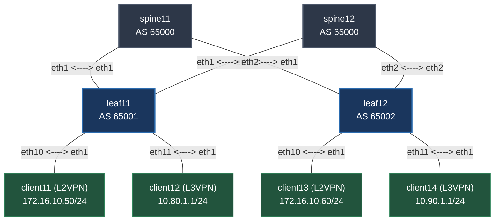

# 4-Node SONiC EVPN-VXLAN 

This repository contains a **4-node SONiC network topology**. The lab simulates an Ethernet VPN (EVPN) data center fabric running **Type 2 (MAC/IP advertisement)** and **Type 5 (IP prefix)** routes over a BGP underlay and BGP overlay, verifying both L2VPN and L3VPN data paths. The lab simulates ECMP and tests BGP Graceful-Restart functionality in SONiC. We will use gRPC interface to push configurations to drain fabric and test GR. 

---

## 🚀 Topology Design

### Node Inventory & Addressing

| Node Name | Role | Container Kind / Image | Management IP | Interface Mapping |
| :--- | :--- | :--- | :--- | :--- |
| **spine11** | Spine | `sonic-vm` (`vrnetlab/sonic_sonic-vs:2511`) | 172.40.40.3 | `eth1` ↔ leaf11, `eth2` ↔ leaf12 |
| **spine12** | Spine | `sonic-vm` (`vrnetlab/sonic_sonic-vs:2511`) | 172.40.40.5 | `eth1` ↔ leaf11, `eth2` ↔ leaf12 |
| **leaf11** | Leaf | `sonic-vm` (`vrnetlab/sonic_sonic-vs:2511`) | 172.40.40.2 | `eth1`/`eth2` ↔ Spines, `eth10`/`eth11` ↔ Clients |
| **leaf12** | Leaf | `sonic-vm` (`vrnetlab/sonic_sonic-vs:2511`) | 172.40.40.4 | `eth1`/`eth2` ↔ Spines, `eth10`/`eth11` ↔ Clients |
| **client11** | L2 Host | `linux` (`network-multitool-sshd:0.0.5`) | 172.40.40.10 | `eth1` (`172.16.10.50/24`) ↔ leaf11 |
| **client12** | L3 Host | `linux` (`network-multitool-sshd:0.0.5`) | 172.40.40.11 | `eth1` (`10.80.1.1/24`) ↔ leaf11 |
| **client13** | L2 Host | `linux` (`network-multitool-sshd:0.0.5`) | 172.40.40.12 | `eth1` (`172.16.10.60/24`) ↔ leaf12 |
| **client14** | L3 Host | `linux` (`network-multitool-sshd:0.0.5`) | 172.40.40.13 | `eth1` (`10.90.1.1/24`) ↔ leaf12 |

### 🔐 Access Credentials

All SONiC network switches (`spine11`, `spine12`, `leaf11`, `leaf12`) and client devices utilize the following uniform login credentials for console, SSH, or direct interactive execution access:

* **Username:** `admin`
* **Password:** `admin`

---

## 🛠 Prerequisites

Ensure your Linux deployment environment has the following components installed and running:

* **Docker Engine** (running and enabled)
* **Containerlab** (Install via `bash -c "$(curl -sL https://containerlab.dev)"`)
* **SONiC Docker Image** (`vrnetlab/sonic_sonic-vs:2511`) loaded inside your local registry.

---

## 🏎️ Deployment Steps

### 1. Clone the Repository
```bash

git clone https://github.com/skyglid3r/sonic-bgp-evpn-grpc
cd sonic-bgp-evpn-grpc
```

### 2. Deploy the Topology
Launch the node containers and build the virtual wiring links defined in the configuration framework:
```bash
sudo containerlab deploy --topo sonic-evpn.clab.yml
```

### 3. Initialize and Provision the Fabric
SONiC containers require time to boot their internal components, configuration databases, and the FRRouting (FRR) protocol suite.

**Wait ~5 minutes** after SONiC nodes come up before running the script to ensure configurations upload fully:
```bash
# Automated 5-minute wait timer
sleep 300

# Make the script executable and apply network configurations
chmod +x deploy-fabric.sh
./deploy-fabric.sh
```

---

## ✅ Verification & Testing

### 1. Control Plane Verification (BGP & EVPN)
Log into the SONiC CLI shell on a Leaf node to confirm underlay state routing and overlay route advertisements.

```bash
# Log into Leaf 11
ssh admin@leaf11

# Go into FRR CLI by typing vtysh

# Verify BGP IPv4 Underlay neighbors are up (Sessions with spine11 & spine12)
show ip bgp summary

# Verify BGP EVPN Overlay neighbor sessions
show bgp l2vpn evpn summary

# Review learned EVPN Type 2 (MAC/IP) and Type 5 (Prefix) routes
show bgp l2vpn evpn
```

### 2. Data Plane Verification (Pings)
Validate successful fabric encapsulation across the VXLAN overlays by executing end-to-end trace pings from your client nodes.

#### L2VPN (Bridged Overlay) Path Verification
Ping across the same broadcast domain stretching from `client11` to `client13`:
```bash
ssh admin@client11
ping -c 4 172.16.10.60
```

#### L3VPN (Routed Overlay) Path Verification
Ping across the isolated tenant subnets routing through the VRF core from `client12` to `client14`:
```bash
ssh admin@client12
ping -c 4 10.90.1.1
```

---

## 🧹 Cleanup and Destruction

To completely tear down the lab topology, remove all virtual wire endpoints, and drop the container environment, run:
```bash
sudo containerlab destroy --topo sonic-evpn.clab.yml --cleanup
```
